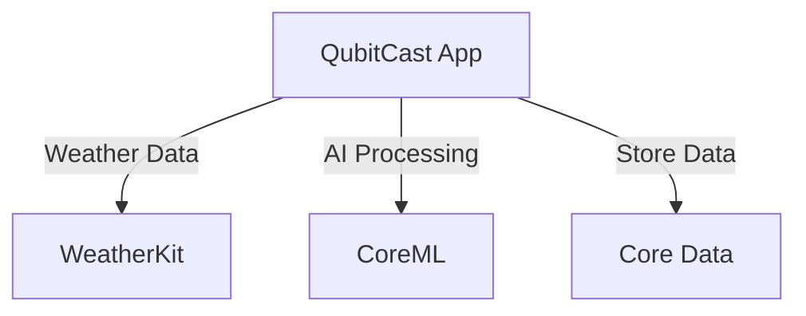

# QubitCast

*AI-powered weather predictions using quantum computing principles*

QubitCast is an innovative iOS weather application that leverages AI and quantum-inspired algorithms to provide hyperlocal weather predictions within a 100-meter radius. It focuses on offline functionality and precision, offering users ultra-local forecasts via on-device processing. The app integrates seamlessly with Apple Watch, providing complications for quick access to current conditions.

## Features

- 100m radius hyperlocal forecasts
- Offline quantum-inspired predictions
- Apple Watch complications

## Tech Stack

- **Frontend**
  - SwiftUI (iOS 15+)
- **Machine Learning**
  - CoreML (Version 3)
- **Weather Data**
  - WeatherKit (iOS 16+)
- **Database**
  - Core Data
- **Infrastructure**
  - Hosted on App Store

## Architecture

QubitCast operates entirely on-device, utilizing local data processing to deliver hyperlocal weather predictions. The app uses Apple's native frameworks, ensuring a smooth and efficient user experience without the need for external servers.



## Project Structure

```
QubitCast/
├── QubitCastApp/
│   ├── Models/
│   │   ├── WeatherModel.swift
│   │   ├── QuantumPredictionModel.swift
│   ├── Views/
│   │   ├── MainView.swift
│   │   ├── ForecastView.swift
│   │   ├── SettingsView.swift
│   ├── ViewModels/
│   │   ├── WeatherViewModel.swift
│   │   ├── QuantumPredictionViewModel.swift
│   ├── Services/
│   │   ├── WeatherService.swift
│   │   ├── QuantumPredictionService.swift
│   ├── CoreData/
│   │   ├── QubitCast.xcdatamodeld/
│   ├── Utilities/
│   │   ├── LocationManager.swift
│   │   ├── Constants.swift
├── QubitCastWatchApp/
│   ├── Complications/
│   │   ├── WeatherComplicationController.swift
│   ├── Views/
│   │   ├── WatchMainView.swift
├── QubitCastTests/
│   ├── WeatherModelTests.swift
│   ├── QuantumPredictionTests.swift
├── QubitCastUITests/
│   ├── MainUITests.swift
```

## Getting Started

### Prerequisites

- Xcode 13 or later
- iOS 15+ device or simulator

### Installation

1. Clone the repository:
   ```bash
   git clone https://github.com/yourusername/QubitCast.git
   cd QubitCast
   ```

2. Open the project in Xcode:
   ```bash
   open QubitCast.xcodeproj
   ```

### Environment Variables

Create a `.env` file in the root directory of your project. You can reference the `.env.example` file included in the repository for required environment variables.

### Running

1. Build and run the app on your chosen device or simulator via Xcode.
2. Select the QubitCast scheme and hit the run button.

## Documentation

For more detailed information, please refer to the following documentation:

- [Product Requirements](docs/PRD.md)
- [Design Brief](docs/DESIGN.md)
- [Architecture](docs/ARCHITECTURE.md)

## License

This project is licensed under the MIT License.